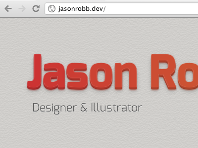

# Example
  

# What it is
3D text using LessCSS, Lettering.js, and CSS3 text-shadows.

# Stuff it uses
[LessCSS](http://lesscss.org)  
[Lettering.js](https://github.com/davatron5000/Lettering.js)  
[jQuery](http://jquery.com)  

# About me
Jason Robb [http://jasonrobb.com](http://jasonrobb.com)  
